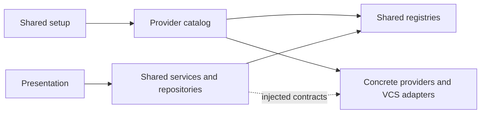

# Provider abstraction status

Updated: 2026-09-05. Original audit: 2026-09-04; re-audit baseline: `b92f78c`.
Historical findings, probe transcripts, and implementation rationale remain in
Git history. This document tracks current boundaries and remaining work.

All concrete provider code and data must live under `lua/parley/providers/`.
Shared workflows consume public contracts, registered implementations, and
provider-supplied metadata. The production inventory contains 77 Lua files:
50 shared files and 27 provider-owned files.

## Current boundaries

| Area | Shared responsibility | Provider-owned responsibility |
| --- | --- | --- |
| Setup/detection | Configuration merge, registries, buffer/context lifecycle | Defaults, factories, initialization, detectors |
| Reviews/cache | Contract validation, identity scoping, snapshots, projections | Identity derivation and normalized review/discussion data |
| Local writes | Revision dispatch, local safety, composer/progress lifecycle | VCS commands/status parsing, target eligibility, mutations |
| Presentation/health | Render public metadata and report diagnostics | Labels, reactions, tool/credential diagnostics |

Shared setup's import of `parley.providers` is the sole direct shared import into
the provider directory. Provider repositories construct instances through the
validated registry. Shared services call injected provider methods and registered
VCS adapters; concrete implementations may use shared infrastructure.

The diagram summarizes composition and delegation, not every module import.
Normalized review states, opaque identifiers, Markdown composition, and common
clean-file protections are intentional shared concepts, not provider leaks.

## Remaining work

### Integrated custom-provider regression

**Status: recommended; not implemented as one integrated workflow.**

Existing tests exercise custom VCS dispatch, metadata, reaction codes, identity,
configuration snapshots, and eligibility separately. Add one workflow with a
provider and VCS deliberately unlike the built-ins: custom detection, opaque
identity/revision/reaction values, display metadata, caching, reactions, and
posting without private GitHub-style fields. Keep real subprocesses and network
requests stubbed while using the actual shared orchestration.

All recorded concrete findings are addressed. Next: this integration coverage. The command-oriented VCS
adapter is an explicit current contract; arbitrary non-CLI VCS support remains
an extensibility consideration rather than a demonstrated regression.

## Resolved work

| Finding | Current behavior / defense |
| --- | --- |
| Concrete VCS implementations | Git/Arc commands and status parsers live under providers; generic adapters dispatch them. |
| Provider-specific health checks | Shared health uses registered diagnostics for the detected provider. |
| Reaction vocabulary | Choices and presentation come from optional provider hooks. |
| Cache identity | Required public identity scopes persistence; shared code reads no provider-private cache fields. |
| Setup/defaults and Arcanum host | Provider catalog owns composition and defaults; factories bind configuration snapshots and forward the host. |
| Statusline branding | Required `display_name` flows through buffer state; no URL inference. |
| Comment eligibility | Required provider validation runs before opening and posting; shared safety checks remain enforced. |
| Construction validation | Repository resolution uses the validated registry before identity resolution. |
| Architecture-policy coverage | Filesystem discovery covers all production modules; provider-layer and static-import checks reject boundary violations. |
| R3: immediate write completion | One lifecycle registers operations before starting, completes once, handles failures, and binds cancellation to the original operation. |
| R1: shared revision alias | Diff reads require an explicit valid review revision and forward it unchanged; missing revisions never invoke adapter commands. |
| R2: optional execution contract | Cancellable hooks and callback/handle types are declared; all present optional methods must be functions. Coroutine fallbacks remain available. |

R2 adds `begin_post_top_level_comment` and `begin_reply` to the declared optional
contract alongside reaction hooks. `parley.WriteResult`, `parley.WriteCallback`,
and `parley.CancelHandle` describe execution without imposing deferred callbacks.
The R3 runtime guards still validate outcomes/handles and preserve drafts on
failures; registry validation checks method presence and types, not execution.
See the [provider interface](lua/parley/provider.lua),
[write lifecycle](lua/parley/services/write_operation.lua), and
[custom-provider help template](doc/parley.nvim.txt.in).

## Verification and limits

Current regression coverage includes optional-method validation through the
registry, posting/replies with and without cancellable starters, callback timing,
cancellation, draft retention, provider metadata, configuration, and VCS dispatch.
See [contract tests](tests/parley/provider_spec.lua),
[write workflow tests](tests/parley/services/write_spec.lua),
[lifecycle tests](tests/parley/services/write_operation_spec.lua), and
[architecture checker tests](tests/parley/policy_checker_spec.lua).

Validation for this change: **911 tests pass**, with clean formatting and lint checks.
No live provider API requests are needed for this refactor. The original audit
probes used injected dependencies; R1's omitted-revision default is now removed.
Structural checks cover supported static imports, not copied algorithms or
arbitrary runtime indirection. Passing them does not establish semantic provider
independence; the integrated custom-provider scenario remains useful.
