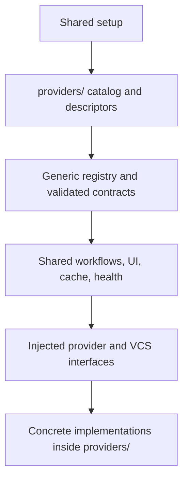

# Provider abstraction findings

Research date: 2026-09-04.

Required boundary: all provider-specific code and data belong under
`lua/parley/providers/`. Shared code delegates provider-specific behavior through
explicit contracts, registration, or dependency injection.

This audit inspected implementation, call sites, configuration, and tests. It did
not execute provider operations or verify live API behavior. Findings describe
the implementation after the shared Arc workflow fix; that fix adds Arc behavior
but does not fully satisfy the directory boundary.

## Concrete leaks

Severity uses a 0–10 scale. Effort is a relative implementation estimate.

### 1. Concrete VCS implementations in shared code

**Status: addressed.** Git/Arc commands and status parsers now live in
`lua/parley/providers/vcs/`. Shared VCS code resolves an explicitly registered
adapter; a provider-owned bootstrap registers built-ins and detector precedence.
Registration, custom-VCS dispatch, setup lifecycle, and dependency-boundary tests
cover this change. The description below records the original finding. See each
subsequent finding for its current status.

**Severity: 8/10. Effort: medium.**

[`vcs/adapters.lua`](lua/parley/vcs/adapters.lua) owns Git and Arc command arrays,
Arc status JSON parsing, and Git's `origin/<base>...<head>` convention. Its closed
adapter table requires modifying shared code whenever another VCS is added.

Move concrete adapters under `providers/` and register or inject them through a
generic VCS contract. Keep dispatch, local safety-check orchestration, and pure
hunk mapping shared.

Keep VCS and hosting-provider contracts distinct: Git can support multiple hosts.
A reusable module such as `providers/vcs/git.lua` satisfies the directory rule
without making future GitLab support depend on the GitHub implementation. This
has lower maintenance cost than copying Git behavior into every hosting provider.

### 2. Health checks implement GitHub detection and authentication policy

**Status: addressed.** Shared health checks now reuse registered detection and
optional provider-spec diagnostic hooks. GitHub and Arcanum own their tool and
credential checks under `providers/`; only the current repository's matching
provider is checked. Diagnostics remain local, have a bounded completion wait,
and do not construct providers or expose tokens. The text below records the
original finding; other outstanding findings are unchanged.

**Severity: 8/10. Effort: medium.**

[`health.lua`](lua/parley/health.lua) universally requires `git` and `gh`. Its
current-buffer checks run Git commands, assume the `origin` remote, recognize
only `github.com`, and call GitHub authentication and private URL-parsing helpers.
Arc users consequently receive misleading diagnostics.

Shared health checks should own Neovim and plugin-infrastructure checks. Provider
descriptors should supply executable requirements and repository/authentication
diagnostics. Reuse registered detection instead of maintaining a second Git-only
detection pipeline. Keep diagnostics local unless explicitly designed to probe
the network; authentication reports must not expose tokens.

An injected diagnostic callback or structured result list keeps presentation
shared and provider knowledge local. Adding more provider branches to health.lua
would preserve the current maintenance problem.

### 3. Reaction UI embeds GitHub's API vocabulary

**Status: addressed.** Providers now own reaction catalogs and presentation via
optional local-only methods. Shared UI merges counts and viewer state, preserves
unknown codes, and validates available choices before mutation. Arcanum remains
read-only with an explicit Parley limitation message. The original finding below
is retained for context; no Arcanum reaction mutation API was added.

**Severity: 8/10. Effort: medium.**

[`discussion_window/render.lua`](lua/parley/discussion_window/render.lua) defines
eight GitHub reaction codes, labels, and emoji. Its `reaction_picker_items()`
always produces that catalog, and
[`discussion_window.lua`](lua/parley/discussion_window.lua) offers it for every
provider before passing the selected code to the write service.

Meanwhile, [`providers/arcanum/mapping.lua`](lua/parley/providers/arcanum/mapping.lua)
preserves Arcanum's raw reaction codes. The shared reaction contract therefore
does not actually normalize the vocabulary assumed by the UI.

Providers should supply supported choices and presentation metadata. Shared UI
should render those values and return an opaque reaction identifier to the
provider. Existing reactions also need provider-supplied display metadata or a
presentation lookup. Unsupported reaction actions should not offer an unrelated
catalog.

This is more extensible than imposing a universal reaction enum, which would
require maintaining cross-provider mappings and handling provider-only reactions.
The popup implementation itself can remain generic.

### 4. Cache identity defaults to GitHub and reads implementation details

**Status: addressed.** Required provider-owned identities now scope memory and
persistent review caches by provider, host, repository, and local credential
context. Shared keys use a versioned hashed namespace without private-field or
factory-option interpretation. Unavailable identities use temporary uncached
state, legacy entries are ignored, and changed-credential fetches are discarded.
Construction now uses the registry's validated provider/options resolution path.
The text below records the original finding.

**Severity: 7/10. Effort: medium.**

[`repositories/review_keys.lua`](lua/parley/repositories/review_keys.lua) reads
`provider._cache_provider`, defaults it to `"github"`, and interprets factory
`opts.repository`. Neither requirement belongs to the validated provider
interface. A custom provider can be misclassified or fail while constructing a
review key.

Require a public, provider-supplied cache identity. Providers determine the
host/repository/viewer scope; shared caching handles serialization and storage.
Remove the GitHub fallback and validate the identity at construction time.

Use a structured identity rather than private-field inspection. Define how cache
keys change and whether old entries should be invalidated. Remote identity must
remain separate from checkout-specific local projections.

### 5. Shared setup owns provider defaults and initialization knowledge

**Status: addressed.** The explicit catalog in `providers/init.lua` owns built-in
registration and delegates defaults, configuration types, factories, and startup
hooks to provider descriptors. Shared setup consumes its generic interface.
Registered factories bind copied settings; constructors retain independent
configuration snapshots, and transports no longer read global configuration.
Arcanum's configured host now reaches request URLs and cache identity; an explicit
constructor host takes precedence. Catalog, setup lifecycle, configuration, and
boundary tests cover this change. The text below records the original finding.

**Severity: 6/10. Effort: medium.**

[`init.lua`](lua/parley/init.lua) defines concrete provider configuration types,
timeout/retry defaults, and Arcanum's hostname. Setup knows detector precedence,
concrete implementation module names, and GitHub's executable-probing hook.
Transport defaults also exist inside the provider implementations.

A catalog under `providers/` should expose descriptors, defaults, initialization
hooks, and detector ordering. Shared setup should consume that catalog through a
generic interface and pass each provider its configuration explicitly.

Prefer an explicit catalog to filesystem auto-discovery: initialization order
and precedence remain reviewable. Preserve existing public configuration keys
while moving ownership of their types, defaults, and interpretation.

#### Related configuration bug: Arcanum host is not forwarded

Shared defaults advertise `providers.arcanum.host`, but
[`repositories/provider.lua`](lua/parley/repositories/provider.lua) passes only
the result of provider detection to the factory. Arcanum detection returns
branch, login, and repository; construction reads `opts.host` and otherwise uses
the default hostname. The normal setup path therefore does not apply the
configured host.

Explicit provider configuration injection should fix this alongside the ownership
change. Test with a non-default hostname.

### 6. Statusline recognizes GitHub itself

**Status: addressed.** Providers now expose mandatory nonblank `display_name`
metadata. Built-in descriptors and instances reuse provider-owned metadata;
the read service projects the name into buffer state. Statusline rendering uses
that field without URL inference, private cache fields, or concrete imports.
Validation, registry, read-state, branding, and boundary tests cover the contract.
Custom providers must add the required field. The text below records the original
finding.

**Severity: 4/10. Effort: small.**

[`statusline.lua`](lua/parley/statusline.lua) maps a private cache identifier to
`"GitHub"` and guesses provider identity from a `github.com` URL substring. Other
providers do not receive equivalent branding.

Expose a public display name through provider metadata and carry it into the
statusline state. Shared rendering should neither infer identity from URLs nor
read private cache fields. A provider-owned label avoids growing a central table
for every new provider.

## Contract decisions and enforcement gaps

### Local safety versus provider comment eligibility

**Status: addressed.** Eligibility is explicitly provider policy. The required
`validate_comment_target(review, target)` method runs before opening a composer
and again before posting. Built-ins retain changed-line eligibility through a
provider-owned helper; shared VCS code only reads the diff. Shared buffer,
checkout, and context checks remain enforced. Provider rejection, exceptions,
and malformed results block posting and preserve existing drafts. Custom providers
must implement the method. The text below records the original finding.

**Severity: 5/10 as an extensibility gap. Effort: medium if generalized.**

[`services/write.lua`](lua/parley/services/write.lua) calls shared VCS validation
that requires every selected line to be in the review diff. This is not proof of
a current provider incompatibility: it can be an intentional Parley policy.

Decide explicitly whether changed-line eligibility is universal product policy
or provider policy. If providers differ, expose `validate_comment_target(...)`
and delegate eligibility. Unsaved-buffer checks, race checks, clean-file policy,
and draft preservation can remain shared. Do not weaken these protections merely
to move implementation files.

### The actual construction path bypasses provider validation

**Status: addressed as part of cache identity.** Provider construction now goes
through `registry.resolve_with_opts()`, preserving `registry.resolve()` while
validating required methods before identity resolution. The description below
records the original issue.

**Severity: 6/10. Effort: small to medium.**

[`registry.resolve()`](lua/parley/registry.lua) validates provider instances, but
[`repositories/provider.lua`](lua/parley/repositories/provider.lua) independently
loops over registered specs and invokes factories without that validation.

Consolidate resolution into one validated path before adding mandatory metadata
or adapter methods. Validate public identity, display metadata, and required
operations there. Optional capabilities should be explicit rather than inferred
from methods that exist only to raise unsupported-operation errors.

### Architecture policy does not enforce the directory boundary

**Status: addressed.** Architecture tests now discover all production Lua files
under `lua/` and `plugin/`, reject missing/duplicate/stale layer assignments, and
place provider implementations in a distinct layer. Tokenized imports resolve
against the discovered inventory; missing internal targets and untracked loader
uses fail validation. Only shared setup may import the provider catalog. The
injectable health loader is explicitly tracked with literal module names.
Checker regression tests cover inventory, syntax, and boundary failures; existing
provider-independent behavior tests remain necessary for copied implementation
logic. The text below records the original finding.

**Severity: 8/10. Effort: medium.**

[`tests/parley/policy_spec.lua`](tests/parley/policy_spec.lua) compares manually
maintained `source_files` and layer lists in [`policy.json`](policy.json), rather
than discovering actual source files. Its dependency checker silently skips
targets without a layer assignment. Provider implementations also share the
broad `infra` layer with generic infrastructure.

Eleven production Lua files were absent from the policy at inspection time:

- `lua/parley/async_operation.lua`
- `lua/parley/discussion_entries.lua`
- `lua/parley/quickfix.lua`
- All five `lua/parley/providers/arcanum/*.lua` modules
- `lua/parley/providers/github/mapping.lua`
- `lua/parley/providers/github/transport.lua`
- `lua/parley/providers/github/vcs_detector.lua`

The test named “assigns every Lua module to exactly one layer” therefore
overstates its coverage. Passing policy tests do not demonstrate provider
isolation.

Discover production files from the filesystem, reject unknown internal dependency
targets, and model provider implementations as a distinct boundary. Shared
consumers should access public contracts or the catalog, not concrete provider
internals. Import checks alone cannot detect copied reaction catalogs or command
tables, so complement structural checks with provider-independent behavior tests.

## Existing good boundaries

- Posting, replies, edits, deletion, and reaction mutations delegate to provider
  methods.
- Discussion fetching delegates to the selected provider.
- Authentication, API endpoints, transport envelopes, and response mapping
  largely reside under `providers/`.
- Pure anchoring, local projections, generic HTTP, and the reaction popup do not
  intrinsically require provider knowledge.
- Normalized review concepts such as `approved`, provider names in documentation
  examples, and an in-memory contract mock are not themselves hosting-specific
  runtime coupling.

The abstract provider interface and normalized data model can remain outside
`providers/`. Move concrete behavior and data, not every occurrence of the word
“provider”.

## Proposed dependency structure

This diagram describes runtime composition and delegation. Shared implementations
should depend on contracts rather than importing concrete implementation modules.

## Test quality and recommended coverage

Existing Arc adapter and write-workflow tests check useful behavior, including
command selection and shared revision handling. They do not enforce where the
concrete implementations live.

Some existing tests actively preserve provider assumptions:

- [`health_spec.lua`](tests/parley/health_spec.lua) expects missing Git and `gh`
  to be universal runtime errors.
- [`discussion_window/render_spec.lua`](tests/parley/discussion_window/render_spec.lua)
  expects fixed GitHub reaction choices.
- [`statusline_spec.lua`](tests/parley/statusline_spec.lua) focuses on GitHub
  presentation without exercising provider-supplied labels.

Recommended regression coverage:

1. Enforce complete filesystem-discovered architecture-policy coverage and reject
   undeclared internal dependencies.
2. Exercise shared workflows with a deliberately different fake provider: custom
   VCS identifier, reaction codes, display name, and cache identity, without
   private GitHub-style fields.
3. Check provider-specific diagnostics without requiring unrelated executables.
4. Verify non-default provider configuration reaches its constructor and transport.
5. Keep concrete command/payload tests under matching provider test directories;
   keep generic dispatch and lifecycle tests at the shared layer.
6. Verify configured detector precedence and repeated setup behavior after moving
   registration into the catalog.

## Suggested implementation order

1. Define validated descriptors and public identity/configuration contracts;
   consolidate provider construction.
2. Move defaults, initialization, and concrete VCS adapters under `providers/`.
3. Delegate health diagnostics and statusline metadata.
4. Delegate reaction choices and presentation; decide target-eligibility ownership.
5. Complete architecture-policy coverage and add the distinct fake-provider tests.

The intended result is that adding a hosting provider requires implementation and
registration under `providers/`, without adding its names, commands, reaction
codes, or private fields to shared workflows.

## Encountered difficulties

The main inspection difficulty was the mismatch between architecture-test names
and their actual coverage. Unlisted modules and dependencies were silently
excluded, making passing policy checks weaker evidence than their names suggest.

### Where to report

If you're sure the reported difficulties above are related to techplatform (e.g. userver, c35),
please report to [aisuite](https://nda.ya.ru/t/EcUMOwSH7eudWX).
